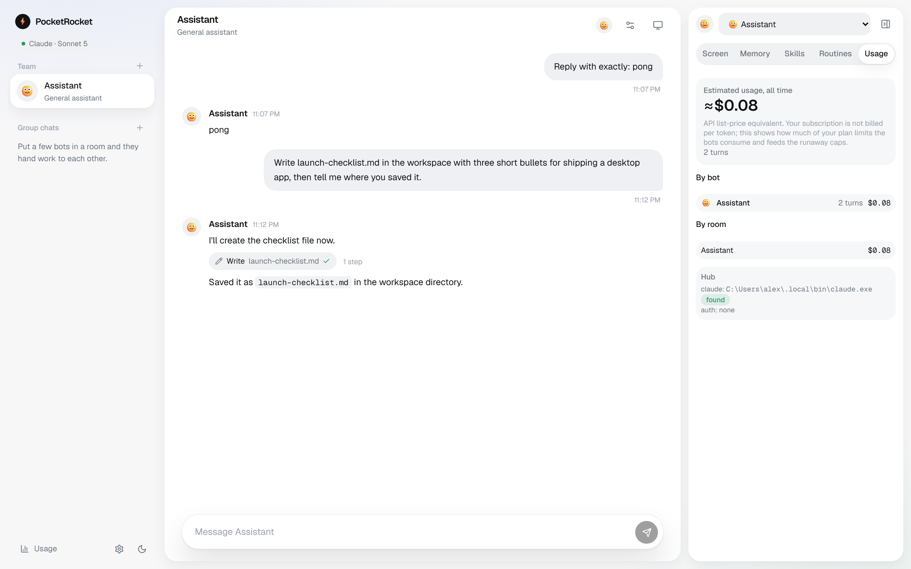

# PocketRocket

**Your pocket fleet of AI agents.**

[**Website**](https://pocketrocket-chi.vercel.app) · [Download](https://github.com/AlexGaledo/pocketrocket/releases/latest) · [Changelog](CHANGELOG.md)

[](./LICENSE)
[](https://github.com/AlexGaledo/pocketrocket/actions/workflows/ci.yml)
[](https://github.com/AlexGaledo/pocketrocket/releases)


PocketRocket is a messenger for a fleet of persistent agents. Each bot has its own identity, memory, skills, and routines; bots share one workspace, talk in DMs or group chats, @mention and hand off work to each other, and ask you for approval before touching anything outside the workspace. It runs entirely on your machine — a Node hub plus a React UI — against a provider you're already logged into: Claude, OpenAI Codex, OpenCode, or Grok.

<picture>
  <source media="(prefers-color-scheme: dark)" srcset="packages/site/assets/app-dark.png" />
  
</picture>

### In short

- **Local.** The hub binds `127.0.0.1` and talks to nothing but the provider you chose. No accounts, no telemetry.
- **Your subscription.** It drives a CLI you already log into instead of asking for a new API key.
- **Persistent.** Every bot keeps an identity and a private memory across sessions and restarts.
- **A team, not a chatbot.** DMs, group chats, @mentions and handoffs between bots in one shared workspace.
- **You hold the keys.** Anything outside the workspace — and any change to what a bot may do — waits on an approval card.
- **Costed.** Spend tracked per bot and per room, with a budget cap per turn.

## Contents

- [Status](#status)
- [Install](#install)
- [Providers](#providers)
- [Concepts](#concepts)
- [Permissions](#permissions)
- [Desktop app](#desktop-app)
- [Run on a server](#run-on-a-server)
- [Development](#development)
- [Contributing](#contributing)

## Status

Pre-release, working toward v1. Concretely:

| Area | State |
|---|---|
| Hub, rooms, memory, skills, routines, approvals | Working, covered by 228 unit tests |
| Claude and OpenCode providers | Verified end to end against real logins |
| Codex and Grok providers | Built to each CLI's documented contract, **never run against a real account** — labelled *Untested* in the picker |
| Windows installer | Builds and installs; **unsigned**, so SmartScreen warns |
| macOS / Linux | Run from source; no installer |
| Auto-update, code signing | Deliberately out of scope for v1 |

Security: the hub always requires a token, binds loopback only, and checks `Origin` and `Host`. The pre-release audit and its remediation are in [`docs/AUDIT-2026-09-09.md`](docs/AUDIT-2026-09-09.md); the threat model, and what the permission rules deliberately do *not* protect against, are in [SECURITY.md](SECURITY.md). Read that before giving a bot the Browser or Desktop tool.

## Install

### Windows installer (recommended)

Download the latest installer from [Releases](https://github.com/AlexGaledo/pocketrocket/releases/latest) and run it.

The installer is **unsigned**, so Windows SmartScreen will warn "Windows protected your PC." Click **More info** → **Run anyway**. If you'd rather not click through that, build from source instead.

### From source (Windows, macOS, Linux)

Requirements: Node ≥ 22.13 (uses built-in `node:sqlite`), pnpm.

```bash
pnpm install
pnpm dev            # hub (tsx watch) + Vite UI at http://127.0.0.1:5173
# or production-ish:
pnpm build && pnpm start   # hub serves the built UI at http://127.0.0.1:7788
```

Building the desktop app additionally requires Rust (MSVC toolchain), Visual Studio Build Tools, WebView2 (bundled with Windows 11), and `cargo tauri`. See [Desktop app](#desktop-app).

## Providers

PocketRocket drives whichever CLI you already use. Pick **one provider for the whole hub** in Settings; pick a **model per bot** within that provider.

> **Claude and OpenCode are verified**: both have been driven end to end against a real login — turns, approval cards, session resume, cost.
> **Codex and Grok are untested.** They are written to each CLI's documented contract and covered by fixtures, but have never been run against a real account, so the provider picker labels them *Untested*. Expect rough edges, and watch the approval cards closely the first time you use one. Reports welcome — see [`docs/PRODUCTION-CHECKLIST.md`](docs/PRODUCTION-CHECKLIST.md) for exactly what still needs verifying.

| Provider | Status | Install the CLI | Log in / key | Auth modes | Permission parity | Cost notes |
|---|---|---|---|---|---|---|
| **Claude** | Verified | `curl -fsSL https://claude.ai/install.sh \| bash` (or see [Claude Code docs](https://code.claude.com/docs/en/agent-sdk/overview)) | `claude` (opens browser login), or set `ANTHROPIC_API_KEY` | Subscription or API key | **Full** — approval cards via a `PreToolUse` hook | Bots default to a cheaper model (`claude-sonnet-5`); the CLI's own default model is far more expensive — PocketRocket sets it explicitly per bot to avoid that trap. Each turn is a fresh process resuming the session; the Claude Code system prompt (~35k tokens) is prompt-cached, so follow-ups are cheap. |
| **OpenAI Codex** | **Untested** | `npm install -g @openai/codex` | `codex login` (ChatGPT subscription), or `codex login --with-api-key` | Subscription or API key | Best effort: workspace sandbox (`--sandbox workspace-write`) + a `request_approval` tool for anything outside it | Reports token usage only (no cost field); the hub computes cost from a rate card. |
| **OpenCode** | Verified | `npm install -g opencode-ai` (see [opencode.ai](https://opencode.ai/docs)) | `opencode auth login` — its own logins: Claude Pro/Max, ChatGPT, GitHub Copilot, SuperGrok, or any API key | Subscription (several providers) or API key | Approval cards via OpenCode's own permission API (`permission.asked` → our approval UI) | Reports per-step cost directly; no aggregate endpoint, the hub sums it. |
| **Grok** | **Untested** | Windows: `irm https://x.ai/cli/install.ps1 \| iex` · macOS/Linux: `curl -fsSL https://x.ai/cli/install.sh \| bash` | Grok Build browser login, or set `XAI_API_KEY` | Subscription (Grok Build login) or API key — note SuperGrok/X Premium subscriptions do **not** include API access; API keys are pay-as-you-go from [console.x.ai](https://console.x.ai) | Best effort: workspace sandbox + a `request_approval` tool for anything outside it | `grok-code-fast-1` is the cheapest tier for coding work; `grok-4-fast` for cheap general use. |

## Concepts

| Thing | Where it lives | Notes |
|---|---|---|
| Bot | `data/pocketrocket.db` + `data/bots/<id>/` | `CLAUDE.md`-style identity file, `memory.md` = private memory (injected every turn), `plugin/` = assigned skills |
| Workspace | `data/workspace/` | Shared cwd for every bot. File tools auto-allowed here; anything outside prompts you |
| DM | room kind `dm` | Bot always replies |
| Group chat | room kind `group`, 1–6 bots | Only @mentioned bots reply. No mention → coordinator bot (if set). Bots can @mention each other; max 5 hops per thread, $5 cost cap per thread |
| Session | one provider session per (bot, room) | Resumed each turn; reset from the Memory tab |
| Skill pool | `data/skills/<name>/SKILL.md` | Import from your provider's skill directory, author in the UI, or let a bot `save_skill` (goes to review first) |
| Routine | cron in DB | Wakes a bot with a prompt in a room while the hub runs |

Custom tools every bot gets: `send_message`, `handoff`, `update_memory`, `read_memory`, `save_skill`, `list_bots`, `read_room`, and full team CRUD: `create_bot`, `update_bot`, `delete_bot` (any bot, including itself, `confirm: true` required), `create_room`, `add_to_room`, `remove_from_room`. A coordinator can recruit its own specialists, put them in a group chat of its own making, retune them, and retire them ("create a researcher and a writer, start a room with them, then draft the post"). Limits: 50 bots per account, 6 per room. The system prompt tells bots not to delete or rewrite a bot unless you asked.

## Permissions

See [SECURITY.md](SECURITY.md) for the token model and the threat model behind these rules — treat every bot like a contractor with a shell on your machine, not a sandboxed toy.

Permission depth depends on what each provider's CLI exposes; see the table above for the summary. In more detail, for providers with hub-mediated permissions:

- `Read/Glob/Grep` inside `data/workspace/` or the bot's home: silent. Outside: an approval card.
- `Write/Edit` inside the workspace: auto-accepted. Outside: approval card.
- `Bash`: an allowlist of read-only/build commands runs silently; anything else asks, and destructive patterns (`rm -rf`, `git push`, `curl | sh`, …) are flagged red. Absolute paths outside the workspace always ask.
- `WebSearch/WebFetch`: silent when enabled for the bot.
- Creating or editing a bot, or changing what tools it's allowed to use, shows an approval card too — a bot can no longer widen its own permissions without a human clicking "allow".
- "Allow for this session" adds a permission rule for the rest of that session; approvals time out after 10 minutes as a deny.

For Codex and Grok, permission parity is **best effort by design**: the provider sandboxes itself to the workspace directory, and a hub-provided `request_approval` tool is injected for anything outside it or otherwise dangerous — the model has to choose to call it, so it's not as airtight as Claude's hook-based interception or OpenCode's native permission API.

The hub always requires a token — every run mode, no exceptions. It's minted on first start and printed as a URL (`http://127.0.0.1:7788/#token=…`); the desktop app and web UI consume that fragment automatically. If you're running with `pnpm start`, either copy that printed URL or read the token straight from `<data>/hub-token`.

Tests: `pnpm test` (vitest in the hub). Debug a provider subprocess with `POCKETROCKET_DEBUG=1`.

## Desktop app

`packages/desktop` is a small native window (WebView2, Tauri) with three ways to run, switchable from its **Connection** menu:

| Mode | What happens | State lives in |
|---|---|---|
| **Local: this PC** (default) | The app starts its own hub as a child process and shuts it down on quit. No network hop. | `%APPDATA%\com.pocketrocket.app\data\` — SQLite db (WAL), bot memories, workspace, skills. `hub.log` next to it. |
| **VPS over SSH tunnel** | Opens an SSH tunnel to the hub on your server itself, waits for it, and respawns the tunnel if it drops. Gets the virtual desktop/screen. | on the VPS |
| **Attach** | Connects to a hub you already run (`pnpm dev` / `pnpm start`). | wherever that hub points |

Node runtime: the desktop app looks for a system Node ≥ 22.13 on `PATH` first; if none is found, it falls back to a Node 24 LTS binary bundled with the installer, so the app works out of the box even with no Node installed.

```bash
pnpm desktop:build      # -> packages/desktop/src-tauri/target/release/PocketRocket.exe
                        #    + bundle/nsis/PocketRocket_<version>_x64-setup.exe
pnpm desktop:dev
```

### Uninstalling

Apps & features → PocketRocket → Uninstall. The installer is per-user and installs nothing but the app
folder and its shortcuts: no Windows service, no scheduled task, no autostart entry, nothing outside
your own user profile.

**Your data is deliberately left behind.** Uninstalling removes the program, not
`%APPDATA%\com.pocketrocket.app\` — the SQLite database, every bot's memory and skills, the shared
workspace, `hub-token`, and `hub.log`. Reinstalling picks up exactly where you left off. To erase it too,
delete that folder by hand after uninstalling.

## Run on a server

The hub is the shared computer: run it on a Linux box and every bot works there, routines fire while your laptop is closed, and a full Linux shell is available to bots.

```bash
# once, on the VPS: install Node 22.13+, pnpm, and your chosen provider's CLI
scripts/deploy.sh <host>            # creates the `pocketrocket` user, uploads, installs, builds, (re)starts both systemd units
ssh -L 7788:127.0.0.1:7788 <host>   # then open the token URL printed by the hub (see below)
```

Everything runs as an unprivileged `pocketrocket` system user, not root; `deploy/setup-vps.sh` creates it the first time. Log the provider CLI(s) in **as that user**, since that is who runs them:

```bash
sudo -u pocketrocket -H claude              # or your provider's login command
sudo -u pocketrocket -H opencode auth login
```

The service (`/etc/systemd/system/pocketrocket.service`) binds `127.0.0.1:7788` only and requires the hub token like every other mode: read it with `sudo cat /home/pocketrocket/pocketrocket/data/hub-token` and open `http://127.0.0.1:7788/#token=<token>` through the tunnel. **Never expose the port directly**; reach it over an SSH tunnel or Tailscale. Data lives in `/home/pocketrocket/pocketrocket/data/` on the VPS. Logs: `journalctl -u pocketrocket -f`.

### Screen: a persistent desktop the bots and you share

`deploy/setup-vps.sh` (run by `scripts/deploy.sh`) installs Xvfb + XFCE + x11vnc + noVNC + xdotool/scrot + a pinned Playwright Chromium, and starts `pocketrocket-screen.service`, also as `pocketrocket`, not root.

What persists (all under `data/`, backed up daily to `/var/backups/pocketrocket`, 7 kept):

- `data/workspace`: the desktop folder itself (Desktop/Downloads/Documents point here)
- `data/desktop-home`: XFCE settings, panel layout, app config, and the X auth cookie
- `data/browser-profile`: Chrome logins, cookies, history
- `data/pocketrocket.db`, `data/bots/<id>` (memory), `data/skills`

Using it: the hub proxies noVNC at `/screen/`, so the same SSH tunnel is enough. Open the **Screen** tab (no second password: the hub token you are already signed in with is the gate, and VNC itself only listens on loopback), then click inside to use the desktop and log into accounts in Chrome once. A **Browser** tool (Playwright MCP over CDP, loopback-only) gives bots fast, precise control of that logged-in Chrome. A **Desktop** tool gives bots full computer use (screenshot, click, type, key, scroll, launch apps) for anything Browser can't reach; slower and costlier (about 1.2k tokens per screenshot), so bots are told to prefer shell, file and Browser tools first. Neither tool goes through approval cards, so only give them to bots you trust with the logged-in sessions on that machine.

Ops: `systemctl status pocketrocket-screen`, `journalctl -u pocketrocket-screen -f`. Restore a backup: stop both services, untar into `/home/pocketrocket/pocketrocket`, `chown -R pocketrocket:pocketrocket` it, start them again.

## Development

```text
packages/shared    models + WS/REST schemas (zod)
packages/hub        Node hub:
                       db/                 SQLite schema + migrations
                       agent/              BotRunner, PromptBuilder, botTools
                       providers/          claude.ts, codex.ts, opencode.ts, grok.ts, registry.ts
                       rooms/              RoomRouter, mentions
                       permissions/        PermissionBroker, pathRules, bashRules
                       services/           Memory, Skill, Routine, Usage
                       api/                REST + WS
packages/web         Vite + React + Tailwind + Zustand UI
packages/desktop     Tauri shell (Rust + WebView2)
packages/site        static landing page (this repo's README lives at the root; the site is deployed separately)
scripts/             smoke.mjs (DM), group-smoke.mjs (3-bot room) — run against a live hub:
                       cd packages/hub && node ../../scripts/smoke.mjs "your message"
```

Debug a provider subprocess with `POCKETROCKET_DEBUG=1`. Run `pnpm test` before sending a PR.

## Contributing

See [CONTRIBUTING.md](./CONTRIBUTING.md).

## License

[MIT](./LICENSE) © 2026 Alex Galedo
